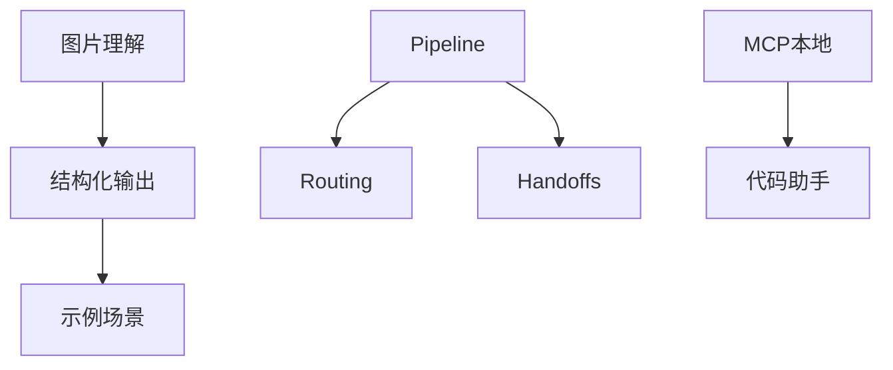

# AgentScope Demo 功能迭代计划（零外部组件版）

> 基于 AgentScope Java 框架 v1.0.11 的后续功能迭代规划
>
> 更新时间：2026-04-20
>
> **原则**：不引入外部组件（如数据库、向量数据库、mem0、Nacos等），仅使用 AgentScope 框架自带能力和本地文件系统

---

## 📋 目录

- [现状总结](#现状总结)
- [第一阶段：多模态能力（高优先级）](#第一阶段多模态能力高优先级)
- [第二阶段：结构化输出与工具增强（中优先级）](#第二阶段结构化输出与工具增强中优先级)
- [第三阶段：多智能体协作（进阶）](#第三阶段多智能体协作进阶)
- [第四阶段：生产化与体验优化（长期）](#第四阶段生产化与体验优化长期)

---

## 现状总结

### ✅ 已实现功能（零外部依赖）

| 模块 | 功能 | 实现方式 |
|------|------|----------|
| **会话持久化** | JsonSession + SessionManagerService | 文件系统存储 (~/.agentscope/demo-sessions/) |
| **AutoContextMemory** | 智能上下文压缩 | 使用 LLM 摘要，6 种策略 |
| **RAG 知识库** | SimpleKnowledge + InMemoryStore | 内存向量存储，支持 PDF/DOCX/TXT/MD |
| **工具系统** | @Tool 注解 + SkillBox | 12+ 预置工具 |
| **可观测性** | ObservabilityHook | 8 种事件类型，前端 Debug 面板 |
| **前端 UI** | 单页聊天界面 | 会话列表、知识库管理、Agent 选择 |
| **前端模块化** | ES6模块 + CSS模块 | 代码行数减少80%+，可维护性提升 |

### 技术栈

```xml
agentscope-spring-boot-starter 1.0.11
├── agentscope-core (ReActAgent, Memory, Session)
├── agentscope-extensions-autocontext-memory (上下文管理)
└── agentscope-extensions-rag-simple (本地知识库)

Spring Boot 3.5.13 + Java 17
Apache POI 5.5.1 + PDFBox 3.0.7
```

---

## 第一阶段：多模态能力（高优先级）

> 解锁图片、音频理解能力，无需额外依赖。

### 1. 图片理解

**AgentScope 能力**: `ImageBlock` + `qwen-vl-max`

**目标**:
- 前端支持图片上传预览
- 后端构建多模态消息
- 支持视觉问答（OCR、图表分析、场景描述）

**实现要点**:

```java
// 1. 前端：扩展文件上传
<input accept=".jpg,.jpeg,.png,.gif,.webp">

// 2. 后端：构建多模态消息
String base64Image = Base64.getEncoder().encodeToString(fileBytes);

Msg multiModalMsg = Msg.builder()
    .role(MsgRole.USER)
    .content(List.of(
        TextBlock.builder().text(userQuestion).build(),
        ImageBlock.builder()
            .source(Base64Source.builder()
                .data(base64Image)
                .mediaType("image/png")
                .build())
            .build()
    ))
    .build();

// 3. 配置视觉模型 Agent
ReActAgent visionAgent = ReActAgent.builder()
    .name("VisionAssistant")
    .model(DashScopeChatModel.builder()
        .modelName("qwen-vl-max")
        .formatter(new DashScopeChatFormatter())  // 必需
        .build())
    .build();
```

**新增 Agent 示例** (`agents.yml`):

```yaml
- agentId: vision-analyzer
  name: Vision Analyzer
  description: 图片理解和分析
  modelName: qwen-vl-max
  streaming: true
  enableThinking: false
  systemPrompt: |
    你是一个视觉分析助手。
    支持的功能：
    - OCR 文字识别
    - 图表数据提取
    - 场景描述
    - 物体识别
    - 图片问答
  supportedFormats: [.jpg, .jpeg, .png, .gif, .webp]
```

**前端展示**:
- 图片预览缩略图
- 支持拖拽上传
- 多图轮播

---

### 2. 音频理解

**AgentScope 能力**: `AudioBlock` + `qwen-audio-turbo`

**目标**:
- 支持语音消息输入
- 语音转文字 + 语义理解

**实现要点**:

```java
// 前端录音 -> Blob -> Base64
Msg audioMsg = Msg.builder()
    .role(MsgRole.USER)
    .content(List.of(
        AudioBlock.builder()
            .source(Base64Source.builder()
                .data(base64Audio)
                .mediaType("audio/wav")
                .build())
            .build()
    ))
    .build();

// 配置音频模型
DashScopeChatModel audioModel = DashScopeChatModel.builder()
    .apiKey(apiKey)
    .modelName("qwen-audio-turbo")
    .formatter(new DashScopeChatFormatter())
    .build();
```

**新增 Agent 示例**:

```yaml
- agentId: voice-assistant
  name: Voice Assistant
  description: 语音助手
  modelName: qwen-audio-turbo
  systemPrompt: |
    你是一个语音助手。
    将用户的语音转为文字，然后理解并回答。
```

---

## 第二阶段：结构化输出与工具增强（中优先级）

> 提升工具能力和输出格式化。

### 3. 结构化输出

**AgentScope 能力**: `StructuredOutputReminder` + `agent.call(msg, Pojo.class)`

**目标**:
- 从文档中提取结构化数据
- 表单自动填写
- 报告生成

**实现示例**:

```java
// 1. 定义 Schema
public class InvoiceInfo {
    public String invoiceNumber;
    public LocalDate invoiceDate;
    public BigDecimal amount;
    public String vendor;
}

// 2. 请求结构化输出
Msg response = agent.call(userMsg, InvoiceInfo.class).block();
InvoiceInfo data = response.getStructuredData(InvoiceInfo.class);

// 3. 新增 Agent
- agentId: invoice-extractor
  name: Invoice Extractor
  description: 从发票图片中提取结构化信息
  modelName: qwen-vl-max
  systemPrompt: |
    你是一个发票信息提取助手。
    从用户上传的发票图片中提取以下字段：
    - invoiceNumber: 发票号码
    - invoiceDate: 开票日期
    - amount: 金额
    - vendor: 销售方名称
    返回 JSON 格式。
  outputType: com.skloda.agentscope.model.InvoiceInfo
```

**前端展示**:
- 结构化结果表格展示
- 支持导出为 Excel/JSON

---

### 4. 工具增强：Web 搜索

**AgentScope 能力**: 自定义 `@Tool` + Tavily API（或 Bing Search API）

**目标**:
- Agent 能搜索实时信息
- 支持新闻、天气、股票查询

**实现示例**:

```java
@Component
public class WebSearchTool {

    @Tool(name = "web_search", description = "搜索网络信息")
    public String searchWeb(
        @ToolParam(name = "query", description = "搜索关键词") String query,
        @ToolParam(name = "limit", description = "返回结果数量") Integer limit
    ) {
        // 调用 Tavily / Bing Search API
        return searchService.search(query, limit);
    }
}

// 新增 Agent
- agentId: search-assistant
  name: Search Assistant
  description: 网络搜索助手
  modelName: qwen-plus
  userTools:
    - web_search
```

---

### 5. PlanNotebook 计划管理

**AgentScope 能力**: 内置 `plan_notebook` 工具

**目标**:
- 复杂任务自动分解
- 步骤追踪和恢复

**使用场景**:

```yaml
- agentId: project-planner
  name: Project Planner
  description: 项目规划和任务分解
  modelName: qwen-plus
  systemPrompt: |
    你是一个项目规划助手。
    当用户提出复杂任务时：
    1. 使用 plan_notebook 工具创建计划
    2. 将任务分解为具体步骤
    3. 逐步执行并追踪进度
    4. 支持暂停和恢复
  systemTools:
    - plan_notebook
```

---

## 第三阶段：多智能体协作（进阶）

> 从单 Agent 升级到多 Agent 协作，无需外部服务。

### 6. Pipeline 多 Agent 管道

**AgentScope 能力**: `SequentialAgent` / `ParallelAgent` / `LoopAgent`

**目标**:
- **串联**: 文档分析 → 信息提取 → 报告生成
- **并联**: 多角度调研后合并
- **循环**: 迭代优化直到质量达标

**实现示例**:

```java
// 1. 串联管道
SequentialAgent sequentialAgent = SequentialAgent.builder()
    .name("doc_pipeline")
    .subAgents(List.of(
        extractorAgent,    // 提取信息
        analyzerAgent,     // 分析数据
        reporterAgent      // 生成报告
    ))
    .build();

// 2. 配置示例 (agents.yml)
- agentId: analysis-pipeline
  type: SEQUENTIAL
  name: Document Analysis Pipeline
  description: 文档分析流水线
  subAgents:
    - extractor
    - analyzer
    - reporter
```

**前端展示**:
- Pipeline 流程图
- 每个 Agent 的执行进度
- 中间结果预览

---

### 7. Routing 路由分发

**AgentScope 能力**: `AgentScopeRoutingAgent`

**目标**:
- 自动分类用户输入
- 路由到专业 Agent
- 支持并行调用后合成

**实现示例**:

```java
// 定义专家 Agent
AgentScopeAgent docAgent = AgentScopeAgent.builder()
    .name("document_expert")
    .description("文档分析专家")
    .outputKey("doc_result")
    .build();

AgentScopeAgent codeAgent = AgentScopeAgent.builder()
    .name("code_expert")
    .description("代码分析专家")
    .outputKey("code_result")
    .build();

// 路由 Agent
AgentScopeRoutingAgent routerAgent = AgentScopeRoutingAgent.builder()
    .name("router")
    .model(model)
    .subAgents(List.of(docAgent, codeAgent))
    .parallel(false)  // 串行调用
    .build();
```

**配置示例**:

```yaml
- agentId: smart-router
  type: ROUTING
  name: Smart Router
  description: 智能路由分发
  modelName: qwen-plus
  subAgents:
    - agentId: doc-expert
      description: 处理文档相关问题
    - agentId: code-expert
      description: 处理代码相关问题
    - agentId: search-expert
      description: 处理网络搜索需求
  parallel: false
```

---

### 8. Handoffs 智能体交接

**AgentScope 能力**: StateGraph + 条件边

**目标**:
- 销售 Agent ↔ 支持 Agent 动态切换
- 对话历史连续性

**实现示例**:

```java
// 交接工具
@Tool(name = "transfer_to_sales")
public String transferToSales(ToolContext toolContext) {
    ToolContextHelper.getStateForUpdate(toolContext).ifPresent(update ->
        update.put("active_agent", "sales_agent"));
    return "已转接至销售智能体";
}

// StateGraph 配置
StateGraph graph = new StateGraph("handoffs", keyFactory)
    .addNode("sales_agent", salesAgent.asNode())
    .addNode("support_agent", supportAgent.asNode())
    .addConditionalEdges(START, new RouteInitialAction(), Map.of(
        "sales_agent", "sales_agent",
        "support_agent", "support_agent"
    ))
    .compile();
```

**前端展示**:
- 当前服务 Agent 提示
- 交接过程通知

---

## 第四阶段：生产化与体验优化（长期）

> 面向演示和用户体验优化。

### 9. MCP 协议集成（本地）

**AgentScope 能力**: `McpClientBuilder` + StdIO 传输

**目标**:
- 支持本地 MCP 服务器（文件系统、Git、SQLite）
- 无需远程服务

**配置示例**:

```yaml
- agentId: mcp-agent
  name: MCP Agent
  description: 支持文件系统和 Git 操作
  modelName: qwen-plus
  mcpClients:
    - name: filesystem
      transport: STDIO
      command: npx
      args: -y,@modelcontextprotocol/server-filesystem,/tmp
      enableTools: [read_file, write_file, list_directory]

    - name: git
      transport: STDIO
      command: npx
      args: -y,@modelcontextprotocol/server-git,/path/to/repo
      enableTools: [git_clone, git_commit, git_push]
```

**本地 MCP 服务器**:
- `@modelcontextprotocol/server-filesystem` - 文件系统
- `@modelcontextprotocol/server-git` - Git 操作
- `@modelcontextprotocol/server-sqlite` - SQLite 数据库

---

### 10. 可观测性增强

**AgentScope 能力**: `JsonlTraceExporter` + ObservabilityHook

**目标**:
- JSONL 格式导出追踪日志
- 本地调试和分析

**实现示例**:

```java
// 配置导出器
try (JsonlTraceExporter exporter = JsonlTraceExporter.builder()
    .path(Path.of("logs", "agentscope-trace.jsonl"))
    .includeReasoningChunks(true)
    .includeActingChunks(true)
    .build()) {

    // 使用 Agent
    agent.call(msg).block();
}

// 前端：下载追踪日志
@GetMapping("/chat/trace/{sessionId}")
public ResponseEntity<Resource> downloadTrace(@PathVariable String sessionId) {
    Path traceFile = Paths.get("logs", sessionId + ".jsonl");
    return ResponseEntity.ok()
        .header("Content-Disposition", "attachment; filename=trace.jsonl")
        .body(new FileSystemResource(traceFile));
}
```

---

### 11. 前端体验优化

**目标**:
- 主题切换（亮色/暗色）
- 快捷键支持
- 导出对话记录

**实现要点**:

```javascript
// 1. 主题切换
function toggleTheme() {
    document.body.classList.toggle('light-theme');
    localStorage.setItem('theme', currentTheme);
}

// 2. 快捷键
document.addEventListener('keydown', (e) => {
    if (e.key === 'Enter' && !e.shiftKey) {
        e.preventDefault();
        sendMessage();
    }
    if (e.key === 'Escape') {
        clearInput();
    }
});

// 3. 导出对话
function exportChat() {
    const messages = getChatMessages();
    const blob = new Blob([JSON.stringify(messages, null, 2)],
                          {type: 'application/json'});
    downloadBlob(blob, `chat-${sessionId}.json`);
}
```

---

### 12. 示例场景模板

**目标**:
- 预置常用场景的 Agent 配置
- 快速演示不同能力

**场景列表**:

| 场景 | Agent 组合 | 演示能力 |
|------|-----------|----------|
| 文档分析流水线 | doc-parser → extractor → reporter | Pipeline + 结构化输出 |
| 智能客服 | router → (sales/support) | Routing + Handoffs |
| 图片发票提取 | vision-analyzer + invoice-extractor | 多模态 + 结构化输出 |
| 知识库问答 | rag-chat + knowledge | RAG + 会话持久化 |
| 代码助手 | code-agent + mcp-agent (git) | MCP + 工具调用 |

---

## 实施顺序

```
Phase 1 (多模态) → 图片理解 → 音频理解
                 ↓
Phase 2 (增强) → 结构化输出 → Web搜索 → PlanNotebook
                 ↓
Phase 3 (协作) → Pipeline → Routing → Handoffs
                 ↓
Phase 4 (优化) → MCP本地 → 可观测性 → UI优化 → 示例模板
```

---

## 技术依赖关系



### 关键依赖说明

| 前置功能 | 依赖功能 | 原因 |
|----------|----------|------|
| 图片理解 | 结构化输出 | 图片提取的数据需要结构化输出 |
| Routing | Pipeline | 先理解单路由再做复杂编排 |
| Pipeline | Handoffs | 理解多 Agent 后再做交接 |

---

## 附录

### 参考文档

- [AgentScope Java 官方文档](https://java.agentscope.io/zh/intro.html)
- [AgentScope GitHub](https://github.com/agentscope-ai/agentscope-java)
- [DashScope 模型列表](https://help.aliyun.com/zh/dashscope/developer-reference/model-list)

### 版本历史

| 版本 | 日期 | 变更 |
|------|------|------|
| 2.0.0 | 2026-04-20 | 零外部依赖版本，移除需要外部组件的功能 |
| 1.0.0 | 2026-04-16 | 初始版本 |

---

*本文档由 Claude Code 生成，基于 AgentScope Java v1.0.11 框架能力分析*
