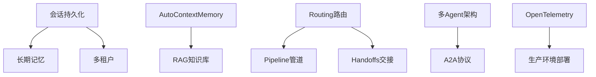

# AgentScope Demo 功能迭代计划

> 基于 AgentScope Java 框架 v1.0.11 的后续功能迭代规划
>
> 更新时间：2026-04-16

---

## 📋 目录

- [现状总结](#现状总结)
- [第一阶段：基础能力补全（高优先级）](#第一阶段基础能力补全高优先级)
- [第二阶段：智能体增强（中优先级）](#第二阶段智能体增强中优先级)
- [第三阶段：多智能体协作（进阶）](#第三阶段多智能体协作进阶)
- [第四阶段：生产化与生态（长期）](#第四阶段生产化与生态长期)
- [实施顺序](#实施顺序)
- [技术依赖关系](#技术依赖关系)

---

## 现状总结

### 已实现功能

| 模块 | 功能 | 说明 |
|------|------|------|
| **Agent 配置** | 5 个预置 Agent | chat-basic, tool-test-simple, task-document-analysis, task-template-docx-editor, tianjin-bank-invoice |
| **工具系统** | @Tool 注解 + 自动扫描 | SimpleTools, DocxParserTool, PdfParserTool, XlsxParserTool, TianjinBankInvoiceTool |
| **Skill 系统** | ClasspathSkillRepository | docx, pdf, xlsx, docx-template, tianjin_bank_invoice_java |
| **可观测性** | ObservabilityHook | 8 种事件类型（agent_start, llm_start, thinking, llm_end, tool_start, tool_end, agent_end, error） |
| **流式推送** | SSE + Flux | ChatController 返回 `Flux<ServerSentEvent<String>>` |
| **文件处理** | 上传/下载 | 支持 .docx, .pdf, .xlsx，UUID 命名，临时目录存储 |
| **前端 UI** | 单页聊天界面 | Agent 选择器、聊天区域、Debug 面板、Markdown 渲染 |

### 技术栈

- **框架**: Spring Boot 3.5.13 + Java 17
- **Agent 框架**: AgentScope 1.0.11 (agentscope-spring-boot-starter)
- **响应式**: Project Reactor (Flux)
- **文档处理**: Apache POI 5.5.1, Apache PDFBox 3.0.7
- **LLM**: DashScope (通义千问 qwen-plus/qwen-max)

---

## 第一阶段：基础能力补全（高优先级）

> 这些是用户体验的核心缺口：对话重启即丢失、长对话 token 爆炸、无法查询知识库。

### 1. 会话持久化 (Session Persistence)

**AgentScope 能力**: `JsonSession` / `SessionManager` / `InMemorySession`

**当前状态**: 每次请求新建 `AgentRuntime`，使用 `InMemoryMemory`，无状态保留

**目标**:
- 对话历史通过 `JsonSession` 持久化到文件系统
- 支持刷新页面/重启应用后恢复会话
- 前端增加会话列表、新建/切换/删除会话功能

**实现要点**:
```java
// 后端: SessionManager 集成
SessionManager sessionManager = SessionManager.forSessionId(sessionId)
    .withSession(new JsonSession(sessionPath))
    .addComponent(agent)
    .addComponent(memory);

// 前端: 会话列表 API
GET /api/sessions -> List<SessionInfo>
POST /api/sessions -> SessionInfo
DELETE /api/sessions/{sessionId} -> void
POST /api/sessions/{sessionId}/activate -> void
```

**文件结构**:
```
~/.agentscope/sessions/
├── user123/
│   ├── memory_messages.jsonl
│   └── plan_notebook.json
```

---

### 2. AutoContextMemory 智能上下文管理

**AgentScope 能力**: `AutoContextMemory` + `AutoContextConfig` + `ContextOffloadTool`

**当前状态**: 仅用 `InMemoryMemory`，消息无限增长

**目标**:
- 长对话自动压缩/摘要/卸载
- 控制消耗，避免上下文窗口溢出

**配置示例**:
```yaml
agents:
  - agentId: chat-with-context
    memory:
      type: AUTO_CONTEXT
      config:
        msgThreshold: 30        # 消息数量阈值
        lastKeep: 10            # 保留最近 N 条
        tokenRatio: 0.3         # 压缩比例
        enableOffload: true     # 启用内容卸载
```

**6 种压缩策略**:
1. 直接截断
2. 滑动窗口
3. 摘要压缩
4. 语义压缩
5. 分层压缩
6. 混合策略

---

### 3. RAG 知识库集成

**AgentScope 能力**: `SimpleKnowledge` / `BailianKnowledge` / `DifyKnowledge` / `RAGFlowKnowledge`

**当前状态**: 无知识库能力

**目标**:
- 用户上传文档自动入库
- 支持语义检索
- 先用本地知识库，后续扩展云托管

**实现方案**:

##### 3.1 本地知识库 (SimpleKnowledge)

```java
// 配置
EmbeddingModel embeddingModel = DashScopeTextEmbedding.builder()
    .apiKey(apiKey)
    .modelName("text-embedding-v3")
    .dimensions(1024)
    .build();

Knowledge knowledge = SimpleKnowledge.builder()
    .embeddingModel(embeddingModel)
    .embeddingStore(InMemoryStore.builder().dimensions(1024).build())
    .build();

// 文档读取
Reader reader = new PDFReader(512, SplitStrategy.PARAGRAPH, 50);
List<Document> docs = reader.read(input).block();
knowledge.addDocuments(docs).block();
```

##### 3.2 Agent 配置

```yaml
agents:
  - agentId: rag-assistant
    ragMode: GENERIC  # 或 AGENTIC
    knowledge:
      type: SIMPLE
      retrieveConfig:
        limit: 3
        scoreThreshold: 0.3
```

##### 3.3 前端扩展

- 知识库管理页面（上传/删除文档）
- 检索结果预览
- 知识库状态监控

---

## 第二阶段：智能体增强（中优先级）

> 解锁 AgentScope 框架的核心差异化能力。

### 4. MCP 协议集成

**AgentScope 能力**: `McpClientBuilder` / `McpClientWrapper` / 3 种传输

**当前状态**: 无 MCP 支持

**目标**:
- 支持连接外部 MCP 服务器
- 通过 `agents.yml` 配置 MCP 连接
- 无需写代码即可扩展 Agent 能力

**支持的传输**:
- **StdIO**: 本地进程通信（文件系统、Git）
- **SSE**: HTTP Server-Sent Events（远程服务）
- **HTTP**: 无状态 HTTP

**配置示例**:
```yaml
agents:
  - agentId: mcp-agent
    mcpClients:
      - name: filesystem
        transport: STDIO
        command: npx
        args: -y,@modelcontextprotocol/server-filesystem,/tmp
        enableTools: [read_file, write_file, list_directory]

      - name: remote-mcp
        transport: SSE
        url: https://mcp.example.com/sse
        headers:
          Authorization: Bearer {token}
```

**常用 MCP 服务器**:
- `@modelcontextprotocol/server-filesystem` - 文件系统操作
- `@modelcontextprotocol/server-git` - Git 操作
- `@modelcontextprotocol/server-sqlite` - SQLite 数据库
- `@modelcontextprotocol/server-postgres` - PostgreSQL

---

### 5. 多模态支持

**AgentScope 能力**: `ImageBlock` / `AudioBlock` / `VideoBlock` + `qwen-vl-max`

**当前状态**: 仅支持文档上传（.docx, .pdf, .xlsx）

**目标**:
- 前端支持图片/音频上传
- 后端构建多模态消息
- 支持视觉模型识别

**实现示例**:

```java
// 创建多模态消息
String base64Image = Base64.getEncoder().encodeToString(
    Files.readAllBytes(Paths.get("image.png"))
);

Msg multiModalMsg = Msg.builder()
    .role(MsgRole.USER)
    .content(List.of(
        TextBlock.builder().text("这张图片是什么颜色？").build(),
        ImageBlock.builder()
            .source(Base64Source.builder()
                .data(base64Image)
                .mediaType("image/png")
                .build())
            .build()
    ))
    .build();

// 配置视觉模型
ReActAgent visionAgent = ReActAgent.builder()
    .name("VisionAssistant")
    .model(DashScopeChatModel.builder()
        .modelName("qwen-vl-max")
        .formatter(new DashScopeChatFormatter())  // 必需
        .build())
    .build();
```

**支持的模型**:
- DashScope: `qwen-vl-max`, `qwen-vl-plus`, `qwen-audio-turbo`
- OpenAI: `gpt-4o`, `gpt-4-vision-preview`
- Anthropic: `claude-3-opus`, `claude-3-sonnet`

---

### 6. 结构化输出

**AgentScope 能力**: `StructuredOutputReminder` + `agent.call(msg, Pojo.class)`

**当前状态**: 无

**目标**:
- 新增"表单提取"类 Agent
- 从自然语言/文档中提取结构化数据到 Java POJO

**实现示例**:

```java
// 定义 Schema
public class InvoiceInfo {
    public String invoiceNumber;
    public LocalDate invoiceDate;
    public BigDecimal amount;
    public String vendor;
}

// 请求结构化输出
Msg response = agent.call(userMsg, InvoiceInfo.class).block();
InvoiceInfo data = response.getStructuredData(InvoiceInfo.class);

System.out.println("发票号: " + data.invoiceNumber);
System.out.println("金额: " + data.amount);
```

**两种模式**:
- `TOOL_CHOICE` (默认): 强制调用工具，一次 API 调用
- `PROMPT`: 提示词引导，可能多次调用

**适用场景**:
- 信息抽取（从发票、合同中提取字段）
- 表单填写
- 报告生成

---

### 7. 长期记忆 (Long-term Memory)

**AgentScope 能力**: `Mem0LongTermMemory` / `ReMeLongTermMemory`

**当前状态**: 无跨会话记忆

**目标**:
- Agent 能记住用户偏好和历史知识
- 支持 `STATIC_CONTROL` 和 `AGENT_CONTROL` 两种模式

**实现示例**:

```java
// Mem0 集成
Mem0LongTermMemory longTermMemory = Mem0LongTermMemory.builder()
    .agentName("SmartAssistant")
    .userId("user-001")
    .apiBaseUrl("https://api.mem0.ai")
    .apiKey(System.getenv("MEM0_API_KEY"))
    .build();

ReActAgent agent = ReActAgent.builder()
    .name("Assistant")
    .model(model)
    .longTermMemory(longTermMemory)
    .longTermMemoryMode(LongTermMemoryMode.STATIC_CONTROL)
    .build();
```

**工作模式**:
- `STATIC_CONTROL`: 框架自动在推理前召回、回复后记录
- `AGENT_CONTROL`: Agent 通过工具自主决定何时记录和召回
- `BOTH`: 同时启用两种模式

**记忆类型**:
- 用户偏好
- 历史对话摘要
- 知识点
- 任务上下文

---

## 第三阶段：多智能体协作（进阶）

> 从单 Agent 升级到多 Agent 协作架构。

### 8. Pipeline 多 Agent 管道

**AgentScope 能力**: `SequentialAgent` / `ParallelAgent` / `LoopAgent`

**当前状态**: 无多 Agent 协作

**目标**:
- **串联管道**: 自然语言 → SQL 生成 → SQL 评分
- **并行管道**: 多角度调研（技术/金融/市场）后合并
- **循环管道**: 迭代优化直到质量达标

**实现示例**:

```java
// 顺序管道
SequentialAgent sequentialAgent = SequentialAgent.builder()
    .name("sql_pipeline")
    .subAgents(List.of(
        sqlGenerateAgent,    // 输出: sql
        sqlRatingAgent       // 输入: sql, 输出: score
    ))
    .build();

// 并行管道
ParallelAgent parallelAgent = ParallelAgent.builder()
    .name("research_pipeline")
    .subAgents(List.of(
        techResearcher,      // 输出: tech_analysis
        financeResearcher,   // 输出: finance_analysis
        marketResearcher     // 输出: market_analysis
    ))
    .mergeStrategy(new DefaultMergeStrategy())
    .mergeOutputKey("research_report")
    .maxConcurrency(3)
    .build();

// 循环管道
LoopAgent loopAgent = LoopAgent.builder()
    .name("sql_refinement")
    .subAgent(sequentialAgent)
    .loopStrategy(LoopMode.condition(messages -> {
        double score = extractScore(messages);
        return score > 0.5;  // 直到得分 > 0.5
    }))
    .maxIterations(5)
    .build();
```

**前端展示**:
- Pipeline 可视化流程图
- 每个 Agent 的执行进度
- 中间结果预览

---

### 9. Routing 路由分发

**AgentScope 能力**: `AgentScopeRoutingAgent` / 分类器

**当前状态**: 用户手动选择 Agent

**目标**:
- 自动对用户输入分类
- 路由到最合适的专业 Agent
- 支持并行调用多个专家后合成回答

**实现示例**:

```java
// 定义专家 Agent
AgentScopeAgent githubAgent = AgentScopeAgent.fromBuilder(...)
    .name("github_expert")
    .description("GitHub 代码搜索和 Issue 分析")
    .outputKey("github_result")
    .build();

AgentScopeAgent notionAgent = AgentScopeAgent.fromBuilder(...)
    .name("notion_expert")
    .description("Notion 文档查询")
    .outputKey("notion_result")
    .build();

// 路由 Agent
AgentScopeRoutingAgent routerAgent = AgentScopeRoutingAgent.builder()
    .name("router")
    .model(model)
    .subAgents(List.of(githubAgent, notionAgent, slackAgent))
    .parallel(true)  // 并行调用专家
    .build();
```

**用户体验**:
- **从**: "选择 Agent → 输入问题"
- **到**: "直接输入问题 → 自动路由"

---

### 10. Handoffs 智能体交接

**AgentScope 能力**: StateGraph + 条件边 + 交接工具

**当前状态**: 无

**目标**:
- 类似客服转接场景
- 销售 Agent 和支持 Agent 之间动态切换

**实现示例**:

```java
// 交接工具
@Tool(name = "transfer_to_support")
public String transferToSupport(ToolContext toolContext) {
    ToolContextHelper.getStateForUpdate(toolContext).ifPresent(update ->
        update.put("active_agent", "support_agent"));
    return "已转接至支持智能体";
}

// StateGraph 配置
StateGraph graph = new StateGraph("handoffs", keyFactory)
    .addNode("sales_agent", salesAgent.asNode())
    .addNode("support_agent", supportAgent.asNode())
    .addConditionalEdges(START, new RouteInitialAction(), Map.of(
        "sales_agent", "sales_agent",
        "support_agent", "support_agent"
    ))
    .addConditionalEdges("sales_agent", new RouteAfterSales(), Map.of(
        "support_agent", "support_agent",
        "__end__", END
    ))
    .compile();
```

**前端展示**:
- 当前服务 Agent 提示
- 交接过程通知
- 对话历史连续性

---

## 第四阶段：生产化与生态（长期）

> 面向生产环境部署和生态集成。

### 11. A2A 协议支持

**AgentScope 能力**: `A2aAgent` + `AgentScopeA2aServer` + Nacos 注册

**当前状态**: 无

**目标**:
- 将 Agent 暴露为 A2A 服务
- 调用远程 A2A Agent
- 支持 Nacos 服务发现

**服务端配置**:
```yaml
agentscope:
  a2a:
    server:
      enabled: true
      card:
        name: My Assistant
        description: 智能助手
        version: 1.0.0
    nacos:
      server-addr: localhost:8848
      username: nacos
      password: nacos
```

**客户端调用**:
```java
A2aAgent agent = A2aAgent.builder()
    .name("remote-agent")
    .agentCardResolver(new NacosAgentCardResolver(nacosClient))
    .build();

Msg response = agent.call(userMsg).block();
```

---

### 12. 用户认证与多租户

**框架支持**: `userId` 隔离

**当前状态**: 无用户体系

**目标**:
- Spring Security 认证
- Session/记忆/知识库按用户隔离
- 支持多租户部署

**实现要点**:
```java
// 用户上下文
String userId = SecurityContextHolder.getContext()
    .getAuthentication().getName();

// 隔离策略
memory = new InMemoryMemory(userId);
sessionPath = Path.of("/sessions", userId);
knowledgeIndex = "knowledge_" + userId;
```

---

### 13. OpenTelemetry 可观测性

**AgentScope 能力**: Tracer SPI + `JsonlTraceExporter`

**当前状态**: 仅 ObservabilityHook 到前端 Debug 面板

**目标**:
- 接入 OpenTelemetry 做分布式追踪
- 生产环境可观测
- JSONL 导出用于本地调试

**配置示例**:
```java
// JSONL 导出（开发环境）
try (JsonlTraceExporter exporter = JsonlTraceExporter.builder()
    .path(Path.of("logs", "agentscope-trace.jsonl"))
    .includeReasoningChunks(true)
    .includeActingChunks(true)
    .build()) {
    // 使用 Agent
}

// OpenTelemetry（生产环境）
// TODO: 等待 agentscope-extensions-otel 模块发布
```

---

### 14. PlanNotebook 计划管理

**AgentScope 能力**: 内置 `plan_notebook` 工具

**当前状态**: 无

**目标**:
- 复杂任务自动分解为有序步骤
- 可追踪、暂停、恢复
- 适合多步骤工作流

**使用场景**:
- 项目规划
- 任务清单
- 流程自动化

---

### 15. AgentScope Studio 对接

**AgentScope 能力**: Studio 可视化调试

**当前状态**: 仅本地 Debug 面板

**目标**:
- 对接 Studio 做可视化调试
- 实时监控和日志分析
- 团队协作调试

---

## 实施顺序

```
Phase 1 (基础) → Session持久化 → AutoContextMemory → RAG知识库
                 ↓
Phase 2 (增强) → MCP集成 → 多模态 → 结构化输出 → 长期记忆
                 ↓
Phase 3 (多Agent) → Routing路由 → Pipeline管道 → Handoffs交接
                 ↓
Phase 4 (生产化) → A2A协议 → 多租户 → OTel可观测性 → Studio对接
```

---

## 技术依赖关系



### 关键依赖说明

| 前置功能 | 依赖功能 | 原因 |
|----------|----------|------|
| 会话持久化 | 长期记忆 | 需要稳定的 Session 存储跨会话记忆 |
| 会话持久化 | 多租户 | 用户隔离需要 Session 级别的 userId |
| AutoContextMemory | RAG 知识库 | 避免上下文管理策略冲突 |
| Routing | Pipeline | 先理解单路由再做复杂编排 |
| Routing | Handoffs | 交接是路由的特化形式 |
| 多 Agent 架构 | A2A 协议 | A2A 用于跨服务的 Agent 调用 |

---

## 附录

### 参考文档

- [AgentScope Java 官方文档](https://java.agentscope.io/zh/intro.html)
- [AgentScope GitHub](https://github.com/agentscope-ai/agentscope-java)
- [A2A 协议规范](https://a2a-protocol.org/latest/specification/)

### 版本历史

| 版本 | 日期 | 变更 |
|------|------|------|
| 1.0.0 | 2026-04-16 | 初始版本 |

---

*本文档由 Claude Code 生成，基于 AgentScope Java v1.0.11 框架能力分析*
